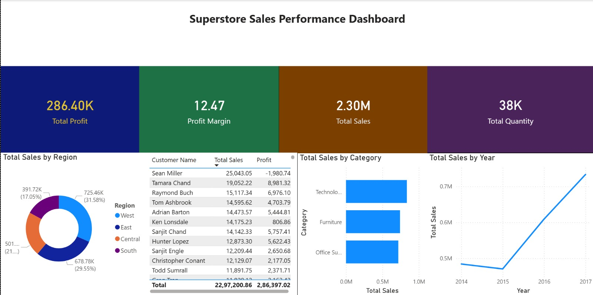

# 📊 Business KPI Dashboard — Superstore Sales Analysis


An end-to-end business analytics project on the Superstore Sales dataset — covering data cleaning, SQL-based insight extraction, and an interactive Power BI KPI dashboard for decision-making.

---

## 📸 Dashboard Preview



---

## 📈 Key Business Insights

| Metric | Value |
|---|---|
| Total Sales (2014–2017) | **$2.30M** |
| Year-over-Year Growth | **~52%** |
| Overall Profit Margin | **12.47%** |
| Top Region by Revenue | **West — 31.58%** |
| Top Category | **Technology** (highest sales & profit) |
| Loss-Making Products | **Tables & Bookcases** (high sales, negative profit) |

---

## 📊 Dashboard Highlights

- KPI cards for **Total Sales, Profit, Quantity, and Margin**
- Region-wise sales distribution
- Category & sub-category performance comparison
- Yearly and monthly sales trend analysis
- Customer-level sales and profit breakdown

---

## 🛠️ Tech Stack

| Tool | Purpose |
|---|---|
| Python (Pandas, Matplotlib) | Data cleaning, preprocessing, EDA |
| SQLite | Business query execution and insight extraction |
| Power BI | Interactive KPI dashboard and visualization |

---

## 📂 Project Structure

```
Superstore-KPI-Dashboard/
│
├── analysis.py                    # Data cleaning & exploratory analysis
├── queries.py                     # SQL queries for business insights
├── Superstore_KPI_Dashboard.pbix  # Power BI dashboard
├── Sample - Superstore.csv        # Raw dataset
├── superstore_cleaned.csv         # Cleaned dataset
├── monthly_trend.png              # Monthly sales trend chart (Python)
├── dashboard.jpeg                 # Dashboard screenshot
└── README.md
```

---

## ⚙️ How to Use

**1. Clone the repository**
```bash
git clone https://github.com/Saksham3124/Superstore-KPI-Dashboard.git
cd Superstore-KPI-Dashboard
```

**2. Install dependencies**
```bash
pip install pandas matplotlib
```

**3. Run data cleaning & EDA**
```bash
python analysis.py
```

**4. Run SQL business queries**
```bash
python queries.py
```

**5. Open the Power BI dashboard**

Open `Superstore_KPI_Dashboard.pbix` in Power BI Desktop and refresh the data source to point to `superstore_cleaned.csv`.

---

## 🎯 Project Objective

To simulate a real-world business analytics workflow by:
- Cleaning and transforming raw retail sales data
- Extracting actionable insights using SQL queries
- Building an interactive dashboard for business decision-making

---

## 📌 Future Improvements

- [ ] Sales forecasting model using time-series analysis
- [ ] Profitability deep-dive by sub-category and customer segment
- [ ] Enhanced dashboard with drill-through and what-if analysis

---

## 👤 Author

**Kumar Saksham**
B.Tech Student — BIT Mesra

[](https://github.com/Saksham3124)
[](https://linkedin.com/in/kumarsaksham)
